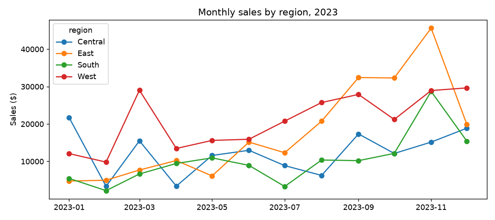
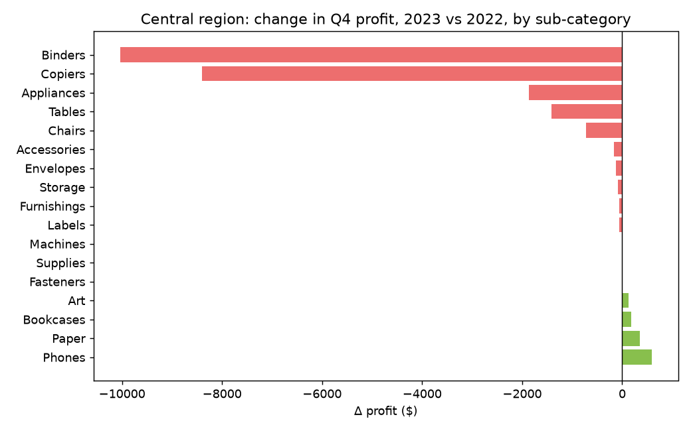

# Part 3 — Devin as data analyst

Three questions of increasing difficulty, answered from the same Postgres database the dashboards use. The SQL for every answer is in `questions.sql`.

## Q1 — Top 10 customers by profit last year (2023)

|   profit_rank | customer_name   | segment     |   sales |   profit |   orders |
|--------------:|:----------------|:------------|--------:|---------:|---------:|
|             1 | Raymond Buch    | Consumer    |  14,203 |    6,781 |        3 |
|             2 | Hunter Lopez    | Consumer    |  10,523 |    5,046 |        2 |
|             3 | Tom Ashbrook    | Home Office |  13,723 |    4,599 |        2 |
|             4 | Andy Reiter     | Consumer    |   5,821 |    2,608 |        2 |
|             5 | Jane Waco       | Corporate   |   5,385 |    1,953 |        4 |
|             6 | Helen Wasserman | Corporate   |   8,166 |    1,947 |        5 |
|             7 | Brian Moss      | Corporate   |   5,683 |    1,938 |        5 |
|             8 | Alan Dominguez  | Home Office |   5,434 |    1,867 |        4 |
|             9 | Jim Epp         | Corporate   |   4,074 |    1,704 |        4 |
|            10 | Steven Roelle   | Home Office |   3,506 |    1,676 |        1 |

**Answer:** Raymond Buch leads with $6,781 profit from 3 orders; the top 10 together made $30,119, 32% of total 2023 profit.

## Q2 — Monthly sales by region (2023)

| month      |   Central |   East |   South |   West |
|:-----------|----------:|-------:|--------:|-------:|
| 2023-01-01 |    21,691 |  4,746 |   5,453 | 12,082 |
| 2023-02-01 |     3,335 |  4,969 |   2,183 |  9,815 |
| 2023-03-01 |    15,505 |  7,700 |   6,644 | 29,024 |
| 2023-04-01 |     3,383 | 10,231 |   9,448 | 13,460 |
| 2023-05-01 |    11,589 |  6,119 |  10,944 | 15,609 |
| 2023-06-01 |    12,967 | 15,161 |   8,934 | 15,920 |
| 2023-07-01 |     8,873 | 12,322 |   3,302 | 20,768 |
| 2023-08-01 |     6,253 | 20,758 |  10,372 | 25,738 |
| 2023-09-01 |    17,343 | 32,416 |  10,201 | 27,907 |
| 2023-10-01 |    12,122 | 32,305 |  12,137 | 21,212 |
| 2023-11-01 |    15,155 | 45,634 |  28,717 | 28,942 |
| 2023-12-01 |    18,883 | 19,879 |  15,415 | 29,652 |

**Answer:** West is the largest region in 8 of 12 months. Company-wide sales peak in November ($118,448), but the regions peak at different times: Central in January ($21,691), East in November ($45,634), South in November ($28,717), West in December ($29,652).

## Q3 — Why did profit drop in the Central region in Q4 2023?

**Step 1 — did it drop?** Central profit by quarter:

|   year |   quarter |   sales |   profit |   avg_discount |
|-------:|----------:|--------:|---------:|---------------:|
|   2022 |         1 |  20,212 |     -275 |           0.27 |
|   2022 |         2 |  25,759 |      223 |           0.29 |
|   2022 |         3 |  33,380 |      438 |           0.2  |
|   2022 |         4 |  68,078 |   19,513 |           0.18 |
|   2023 |         1 |  40,530 |    3,921 |           0.24 |
|   2023 |         2 |  27,939 |    3,099 |           0.28 |
|   2023 |         3 |  32,469 |    2,690 |           0.22 |
|   2023 |         4 |  46,160 |   -2,159 |           0.24 |

Q4 2023 profit was $-2,159 on $46,160 sales (-4.7% margin), versus $2,690 in Q3 2023 and $19,513 in Q4 2022 — sales rose but profit fell.

**Step 2 — where?** Change in Q4 profit by sub-category, Central only:

| sub_category   |   profit_q4_2023 |   profit_q4_2022 |   delta |   avg_discount_2023 |
|:---------------|-----------------:|-----------------:|--------:|--------------------:|
| Binders        |            -4448 |             5587 |  -10035 |                0.47 |
| Copiers        |                0 |             8400 |   -8400 |                0    |
| Appliances     |             -793 |             1079 |   -1872 |                0.53 |
| Tables         |             -670 |              746 |   -1416 |                0.25 |
| Chairs         |              587 |             1306 |    -719 |                0.24 |
| Accessories    |              681 |              841 |    -161 |                0.1  |
| Envelopes      |               45 |              168 |    -123 |                0.13 |
| Storage        |               90 |              175 |     -84 |                0.1  |
| Furnishings    |             -735 |             -675 |     -60 |                0.38 |
| Labels         |               58 |              116 |     -58 |                0.09 |
| Machines       |                0 |                0 |       0 |                0    |
| Supplies       |               12 |                8 |       5 |                0.1  |
| Fasteners      |               52 |               42 |       9 |                0.1  |
| Art            |              208 |               87 |     121 |                0.14 |
| Bookcases      |             -104 |             -290 |     186 |                0.26 |
| Paper          |              808 |              458 |     350 |                0.12 |
| Phones         |             2049 |             1464 |     585 |                0.15 |

**Step 3 — is Central's discounting unusual?** Average discount and margin by region, 2023:

| region   |   avg_discount |   margin |
|:---------|---------------:|---------:|
| Central  |           0.24 |     0.05 |
| South    |           0.15 |     0.07 |
| East     |           0.15 |     0.15 |
| West     |           0.1  |     0.17 |

**Step 4 — which orders?** The ten worst order lines in Central, Q4 2023:

| order_date   | customer_name   | sub_category   | product_name                                                                         |   sales |   discount |   profit |
|:-------------|:----------------|:---------------|:-------------------------------------------------------------------------------------|--------:|-----------:|---------:|
| 2023-12-07   | Henry Goldwyn   | Binders        | Ibico EPK-21 Electric Binding System                                                 |   1,890 |        0.8 |   -2,929 |
| 2023-11-19   | Nathan Cano     | Binders        | Fellowes PB500 Electric Punch Plastic Comb Binding Machine with Manual Bind          |   1,525 |        0.8 |   -2,288 |
| 2023-12-02   | Joy Smith       | Appliances     | 3.6 Cubic Foot Counter Height Office Refrigerator                                    |     295 |        0.8 |     -766 |
| 2023-10-09   | Cyma Kinney     | Tables         | Bevis Oval Conference Table, Walnut                                                  |     652 |        0.5 |     -431 |
| 2023-11-10   | Edward Becker   | Furnishings    | Tenex Antistatic Computer Chair Mats                                                 |     342 |        0.6 |     -427 |
| 2023-12-14   | Dave Brooks     | Furnishings    | Rubbermaid ClusterMat Chairmats, Mat Size- 66" x 60", Lip 20" x 11" -90 Degree Angle |     266 |        0.6 |     -293 |
| 2023-11-25   | Rose O'Brian    | Appliances     | Fellowes Command Center 5-outlet power strip                                         |      68 |        0.8 |     -180 |
| 2023-12-17   | Logan Currie    | Appliances     | Eureka Sanitaire  Commercial Upright                                                 |      66 |        0.8 |     -179 |
| 2023-10-13   | Troy Staebel    | Binders        | GBC VeloBinder Electric Binding Machine                                              |      97 |        0.8 |     -145 |
| 2023-11-19   | Jonathan Howell | Tables         | BPI Conference Tables                                                                |     219 |        0.5 |     -131 |

**Answer:** Two things happened. (1) **Binders** flipped from +$5,587 to $-4,448 (a $10,035 swing) because Central sold them at an average 47% discount; the two worst lines are binding machines sold at 80% off, losing $2,929 and $2,288. (2) The Q4 2022 baseline was inflated by a one-off $8,400 Copiers profit that did not repeat. Central's average discount (24%) is the highest of the four regions (regions table above), which is why its year-end volume turns into losses. Recommended action: cap discounts on Binders/Appliances/Tables in Central and treat the 2022 Copiers sale as a one-off when setting Q4 targets.
